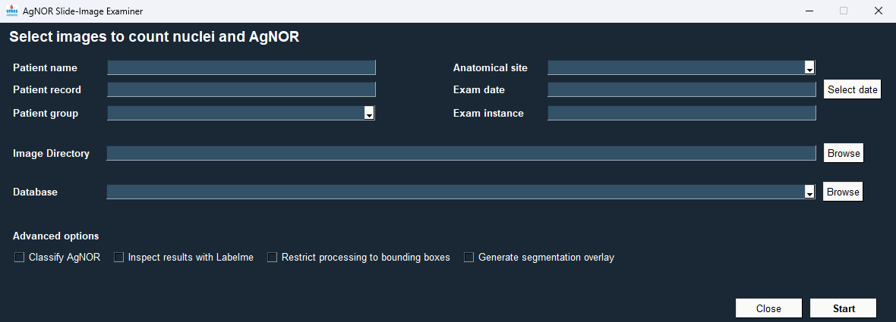

# AgNOR Slide-Image Examiner

Examines AgNOR slide-images using a convolutional neural network and produces counts of nuclei and NORs in the `.csv` format.



## Download

You can download built executables (Windows and Linux) from the page (coming soon).

To use GPU acceleration, install (optional):

- `CUDA 11.2`
- `CUDNN 8.1`

[Microsoft Visual C++ Redistributable for Visual Studio 2015, 2017 and 2019](https://learn.microsoft.com/en-US/cpp/windows/latest-supported-vc-redist?view=msvc-170) is required for running on Windows.

## Run from source or build a standalone executable

1. Install [Anaconda](https://www.anaconda.com/).
2. Execute the following commands:

```console
git clone https://github.com/maikelroennau/agnor-slide-image-examiner.git
cd agnor-slide-image-examiner
conda env create -n asie --file environment.yml
conda activate asie
```

3. Download the pre-trained models and place them in the root directory of the cloned repository. The models can be downloaded from [this link](https://ufrgscpd-my.sharepoint.com/:f:/g/personal/00330519_ufrgs_br/EnzAQbs3_4FHlbxemScpD9IBVKNpGUbXRH0Oqqw7nFkYGA?e=vRbBpS).

Make sure the model file you want to use matches the `MODEL_PATH` value in the `utils/utils.py` file.

### Run the main script

```console
python agnor_slide_image_examiner.py
```

### Compile the standalone executable

```console
pyinstaller "AgNOR Slide-Image Examiner.spec"`
```

The executable will be in the `dist` directory.

**Note**: For the executable to work using GPU, `CUDA` and `cuDNN` must be installed in the OS at build time, and not in Anaconda.

## Usage

Double click on the executable in `dist/` to run the application. Other options are available by running the executable or the `main.py` script from the command line:

```console
"AgNOR Slide-Image Examiner.exe" --help
# or
python main.py --help

# Output:
usage: main.py [-h] [--model MODEL] [--gpu GPU]
               [--input-directory INPUT_DIRECTORY] [--patient PATIENT]
               [--patient-record PATIENT_RECORD]
               [--patient-group PATIENT_GROUP]
               [--anatomical-site ANATOMICAL_SITE] [--exam-date EXAM_DATE]
               [--exam-instance EXAM_INSTANCE] [--classify-agnor] [--bboxes]
               [--overlay] [--database DATABASE] [--console] [--debug]

AgNOR Slide-Image Examiner

optional arguments:
  -h, --help            show this help message and exit
  --model MODEL         Path to the model to be used. Will replace the
                        embedded model if specified.
  --gpu GPU             Set which GPU to use. Pass '-1' to run on CPU.
  --input-directory INPUT_DIRECTORY
                        Input directory.
  --patient PATIENT     Patient name.
  --patient-record PATIENT_RECORD
                        Patient record number.
  --patient-group PATIENT_GROUP
                        Patient group.
  --anatomical-site ANATOMICAL_SITE
                        Anatomical site.
  --exam-date EXAM_DATE
                        Exam date.
  --exam-instance EXAM_INSTANCE
                        Exam instance.
  --classify-agnor      Classify AgNORs.
  --bboxes              Use bounding boxes to restrict segmentation results.
  --overlay             Generate overlay of input images and segmentation.
  --database DATABASE   Database file. A `.csv` to write the aggregate
                        measurements to.
  --console             Enable or disable console mode. If enabled, no GUI
                        will be displayed.
  --debug               Enable or disable debug mode to log execution to a
                        file.
```

**Note**: Instructions use the executable for Windows but they also apply for Linux, except that the Linux executable does not have the `.exe` extension.

## Config file

The program loads some of the menu options from a `config.txt` file. There are tree configuration options:

- `group`: names of groups patients belong to.
- `site`: site from where cells were collected from patients.
- `database`: a file where the program will append all generated records.

To add new entries, use the prefixes `group:`, `site:`, or `database:` followed by the information. Only one entire per line is supported. To remove an entry, either delete the line or comment it out by adding a `#` at the beginning of the line.
